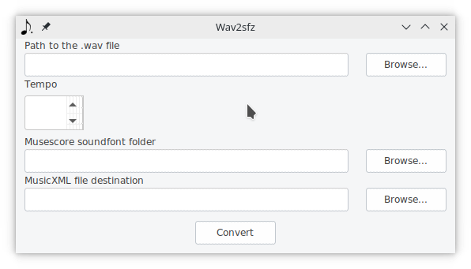
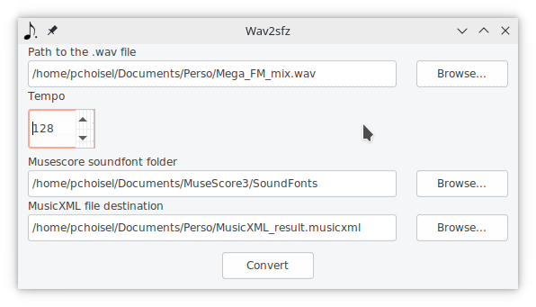

# Using the tool user interface

Download the latest release of the tool from github : [Releases](https://github.com/paulchoisel/wav2sfz/releases/) and execute it.

  

In the new window, you have to enter four values :

 - Path to the .wav file : This is the absolute path to the .wav file of your audio track. Ex: `C:\Users\myuser\Documents\4th_symphony.wav`
 - Tempo : The tempo of the audio track. It will be used to divide the track into bars, so it needs to be as precise as possible.
 - Musescore soundfont folder. The path to the folder where Musescore scores the user's soundfonts.
 > the default location is:
 > Windows: %HOMEPATH%\Documents\MuseScore3\Soundfonts
 > macOS and Linux: ~/Documents/MuseScore3/Soundfonts
(From https://musescore.org/en/handbook/3/soundfonts-and-sfz-files)
 - MusicXML file destination. The path where the MusicXML (the template score) will be created.

When a Browse button is located next to a field, you can use it to display a dialog helping you inputting the value.

  

When all the values are set, click on the Convert button.  
If everything works properly, a message should confirm the success of the conversion.

## Next

You already have a score and you want to import the audio track : [04-Importing the result](04-Importing_the_result.md)  
You don't have a score yet and want to use the template : [05-Using the template score.md](05-Using_the_template_score.md)