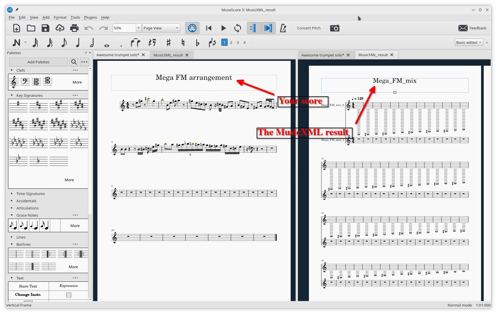
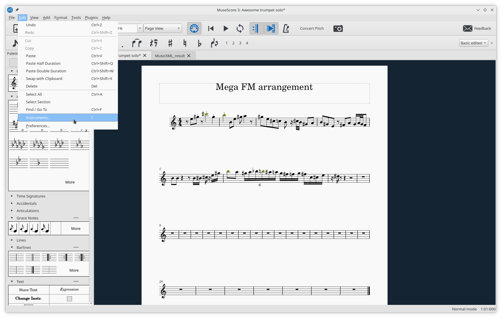
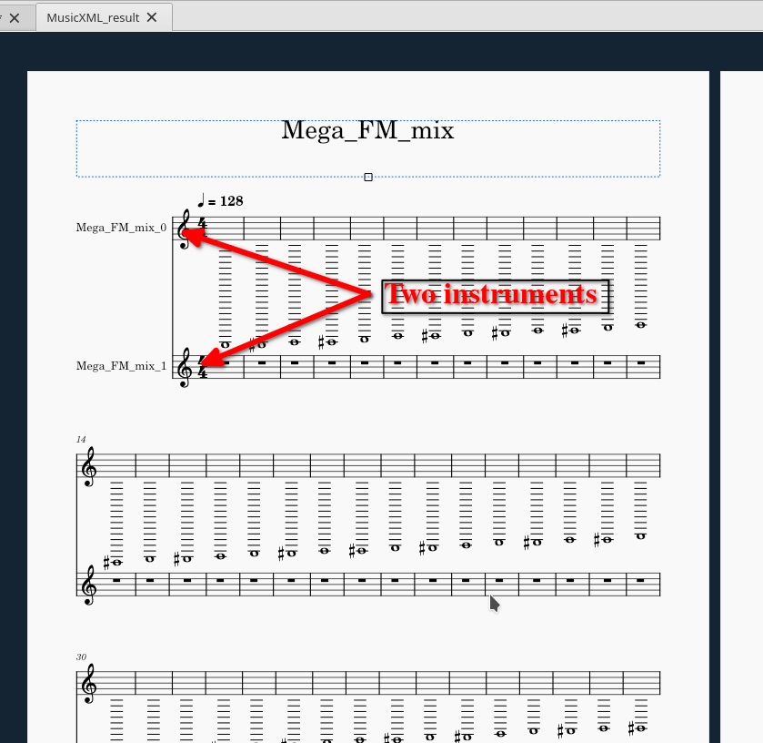
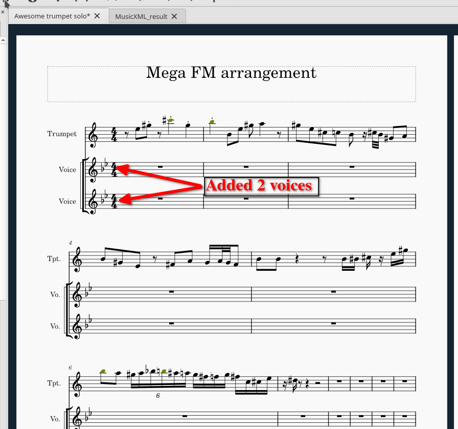
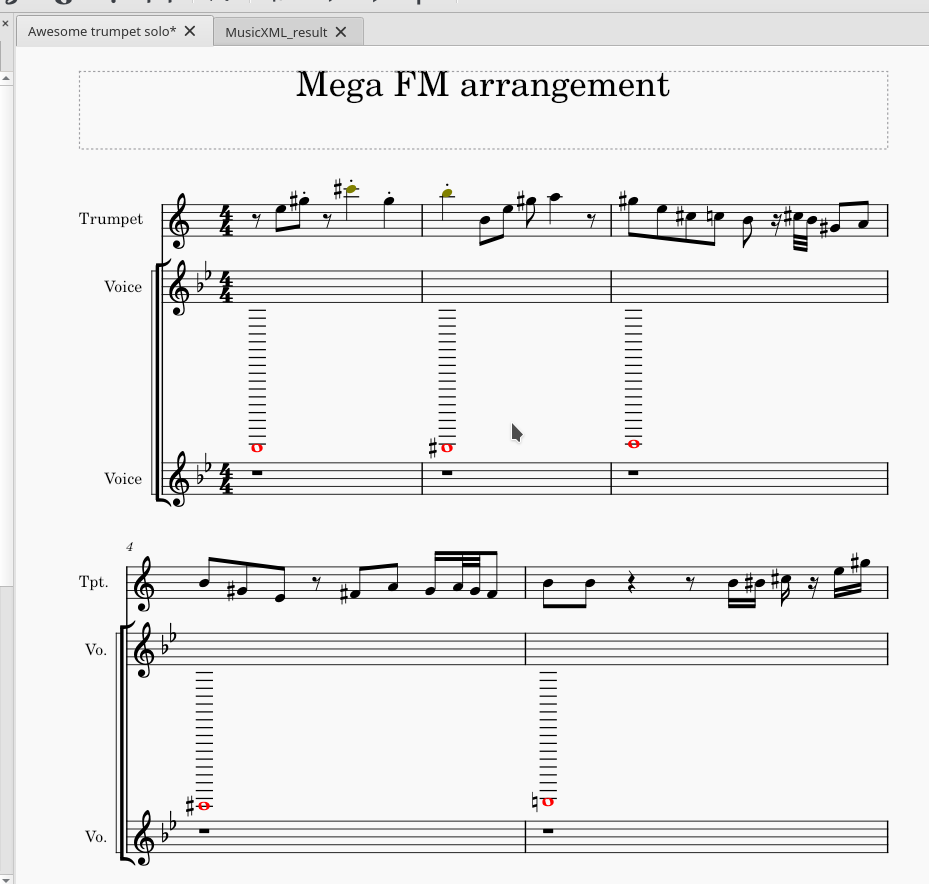
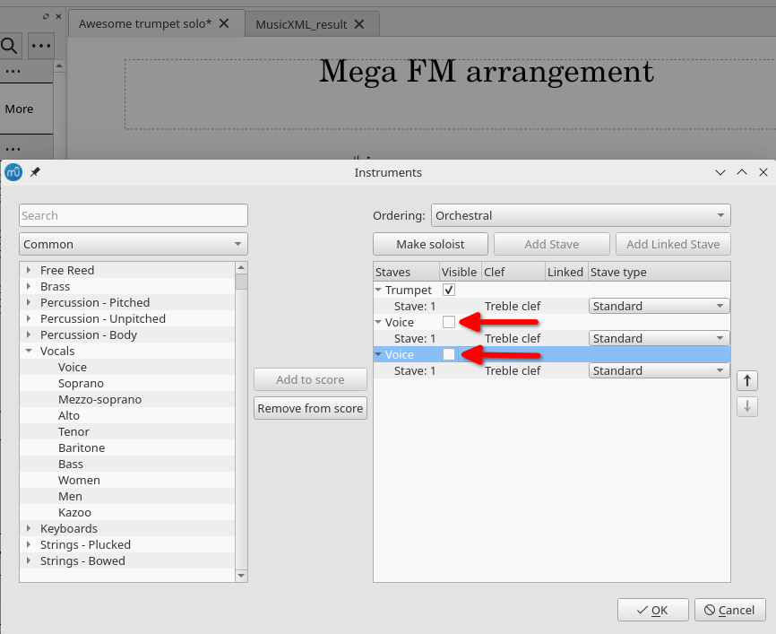

# You already have a score
 - Open your score and the MusicXML file with Musescore

  

 - In your existing score, navigate to Edit -> Instruments

 

 - Add as many voices as there are instruments in the MusicXML file

For example, in this MusicXML, there are two instruments

So add 2 voices to your score :

 - Copy and paste the notes from the MusicXML file to the voices you created in your existing score

 - Reopen the instruments panel and make the voices you added invisible

 - Close the MusicXML file

## Next

Import the soundbanks and assign it to the voices : [06-Assign the soundbank to the voices.md](06-Assign_the_soundbank_to_the_voices.md)