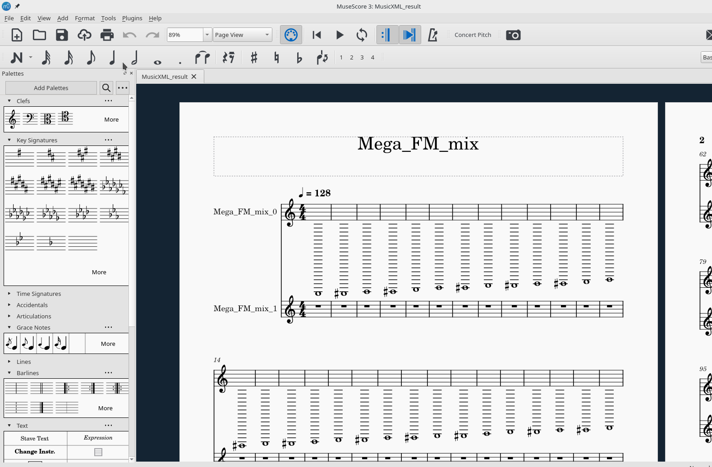
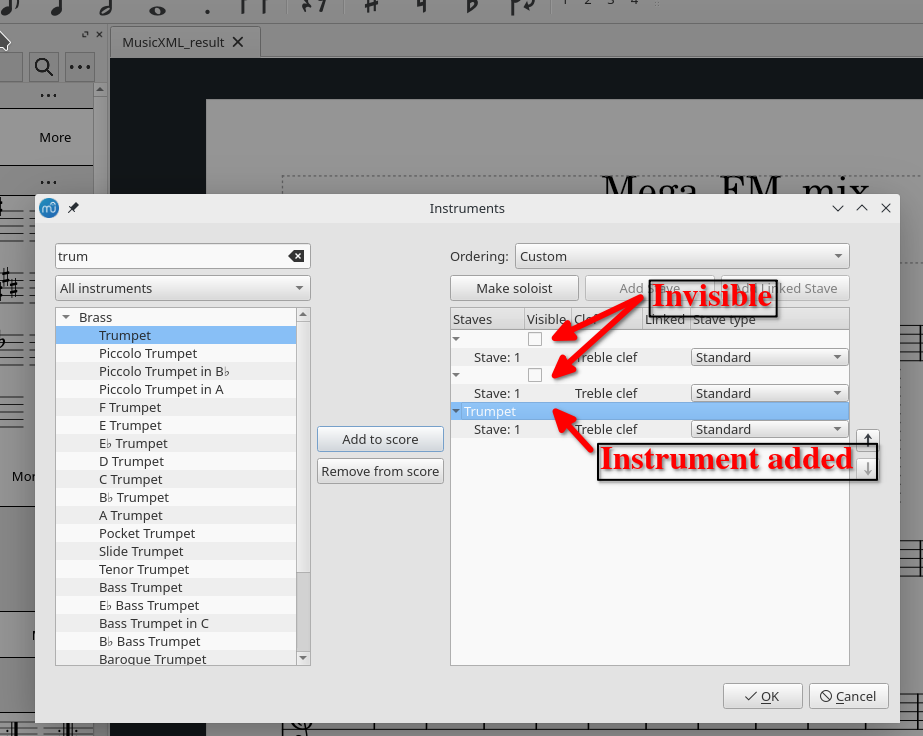

# You don't have a score yet :

 - Open the MusicXML file with Musescore

 - Navigate to Edit -> Instruments

 

 - Make the existing instruments invisible and add the instruments you want for your score.

 

## Next

Import the soundbanks and assign it to the voices : [06-Assign the soundbank to the voices.md](06-Assign_the_soundbank_to_the_voices.md)