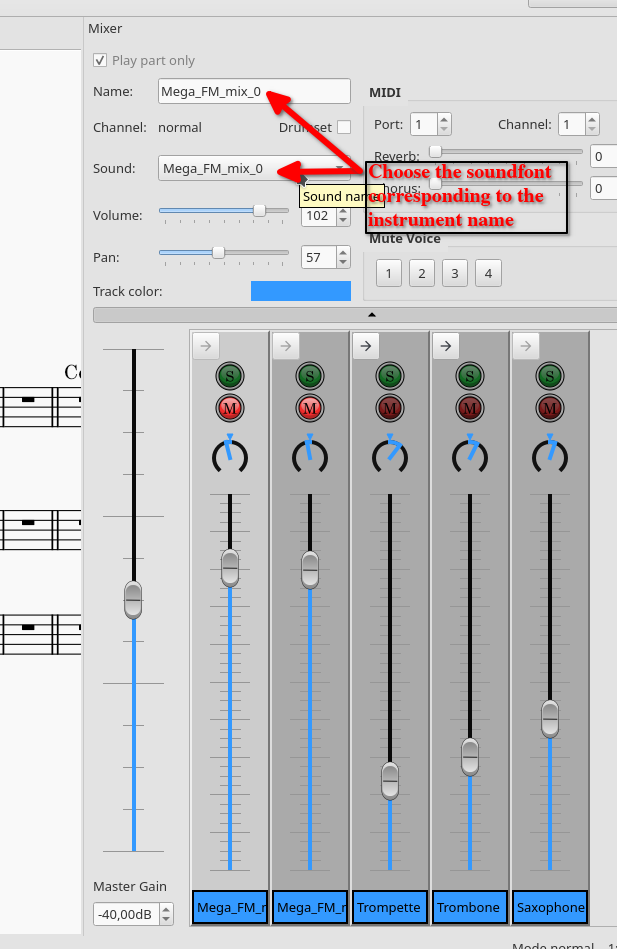

## Assign the soundbanks to the organs

 - In Musescore, in View, enable the Synthesizer panel

 - Select the Zerberus tab and, click on Add

 - In the new Window, select the SFZ soundbanks corresponding to your audio track and select Load

 - Close the synthesizer window
 - In View, enable the Mixer panel (or press F10)

 - In the Mixer, select the instruments we added (or the one that were predefined in the MusicXML file)
 - From left to right, assign the sounds corresponding to your audio track

 - Go to the beginning of the score, press play and you should here your audio track !
 - A bit of mixing can be necessary to harmonize the volumes of your track and Musescore's MIDI instruments.